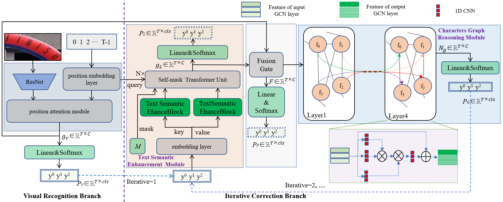

# SEGR:Semantic Enhancement and Graph Reasoning for Irregular Scene Text Recognition
cene text recognition is an important research field focused on visual understanding, which involves cross-modal processing of visual and text semantic information. Accurately recognizing irregular scene text, which has problems such as low resolution, blurriness, deformation, uneven illumination, and so on, is a common challenge for existing scene text recognition methods. In this paper, we proposed a novel scene text recognition method based on text semantic enhancement and characters graph reasoning (SEGR) to improve the accuracy of irregular text recognition. Specifically, SEGR consists of a visual recognition branch that performs preliminary recognition based on visual features and an iterative correction branch that performs the correction of the preliminary recognition by mining semantic information and relationships between characters. The iteration correction branch consists of a text semantic enhancement module based on transformer and a relational reasoning module based on characters graph.



## Requirements
```
pip install torch==1.7.1 torchvision==0.8.2 fastai==1.0.60 opencv-python tensorboardX lmdb pillow
```
## Datasets
We used datasets in LMDB format for training and evaluation. Synthetic datasets MJSynth, SynthTex and WikiText were used in the training process, and three irregular text datasets and three regular text datasets were used in the evaluation process.<br>
* training datasets<br>
  * [MJSynth(MJ)](https://www.robots.ox.ac.uk/~vgg/data/text/)<br>
  * [SynthTex(ST)](https://www.robots.ox.ac.uk/~vgg/data/scenetext/)<br>
  * [WikiText](https://s3.amazonaws.com/research.metamind.io/wikitext/wikitext-103-v1.zip)<br>
* Evaluation datasets<br>
The evaluation data set can be downloaded from [GoogleDrive](https://drive.google.com/file/d/1mYM_26qHUom_5NU7iutHneB_KHlLjL5y/view?usp=sharing). It can also be downloaded from the corresponding official website. <br>
  * Regular scene text datasets<br>
    * [ICDAR2013(IC13)(passwd:3c3e)](https://pan.baidu.com/s/1KwKt63R1NQR42MuckUs7kg?pwd=3c3e)<br>
    * [Street View Text(SVT)(passwd:mv7r)](https://pan.baidu.com/s/1_SwRxc_KX7boC_F6qcrUXw?pwd=mv7r)<br>
    * [IIIT5k(IIIT)(passwd:kq88)](https://pan.baidu.com/s/1_JKzCDpRUTwlV0aEd12oxQ?pwd=kq88)<br>
  * Irregular scene text datasets<br>
    * [ICDAR2015 (IC15)(passwd:1vfw)](https://pan.baidu.com/s/1Ss3icBNdIDQs-O7fs4m2hw?pwd=1vfw)<br>
    * [SVT Perspective(SVTP)(passwd:j2ck)](https://pan.baidu.com/s/1oww4-fXXl1AHzl1tH2TD5A?pwd=j2ck)<br>
    * [CUTE80(CUTE)(passwd:m0kt)](https://pan.baidu.com/s/1WSmqywc31RC7qmAFqAzzyQ?pwd=m0kt)<br>
* The directory structure of the dataset is as follows:<br>

    ```
    data
    ├── charset_36.txt
    ├── evaluation
    │   ├── CUTE80
    │   ├── IC13_857
    │   ├── IC15_1811
    │   ├── IIIT5k_3000
    │   ├── SVT
    │   └── SVTP
    ├── training
    │   ├── MJ
    │   │   ├── MJ_test
    │   │   ├── MJ_train
    │   │   └── MJ_valid
    │   └── ST
    ├── WikiText-103.csv
    └── WikiText-103_eval_d1.csv
    ```
## Models
The SEGR pretrained model provided by us is on [BaiduNetdisk(passwd:ph33)](https://pan.baidu.com/s/1193tym9Mc2TpSOeTHomdcg?pwd=ph33), you can download it by yourself. The performance of the pretrained model on the evaluation datasets are shown in the following table:

|Model|IC13|SVT|IIIT|IC15|SVTP|CUTE|
|-|-|-|-|-|-|-|
|SEGR|97.7|94.1|96.4|86.0|90.1|92.7

## Training

If you want to train the model, you can use the following command:

```
CUDA_VISIBLE_DEVICES=0, 1 python main.py --config=configs/train_segr.yaml
```

## Evaluation

If you want to evaluate the model, you can use the following command:

```
CUDA_VISIBLE_DEVICES=0, 1 python main.py --config=configs/train_segr.yaml --phase test --image_only
```

## Acknowledgements

This PyTorch implementation is based on ABINet.


